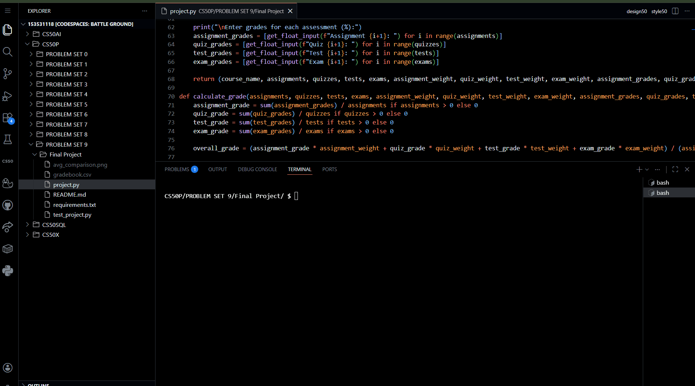
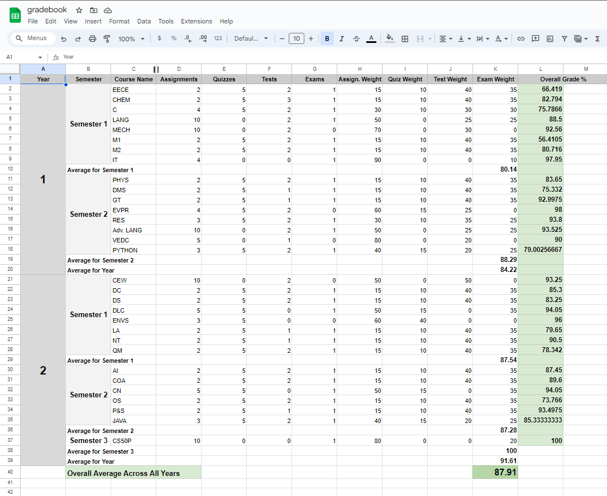
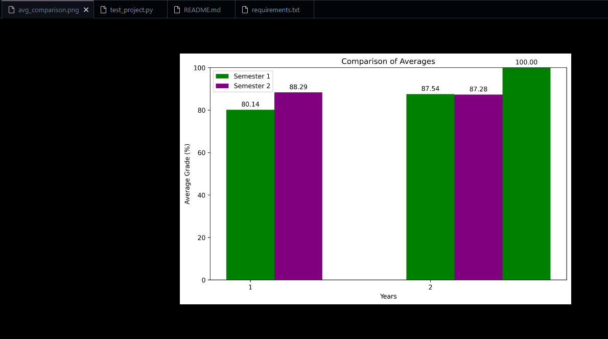

<h1 align="center">📚 Gradebook Generator - CS50P Final Project ✏️</h1>
<h3 align="center">CS50P Final Project — Multi-Year Grade Tracking + CSV Export + Average Visualization</h3>

<p align="center">
  
  
  
  
  
  
</p>

---

<p align="center">
  
</p>

<p align="center">
  <a href="https://youtu.be/m8qcIzR_kCo">
    
  </a>
</p>

---

## 📃 Description

For my final project in CS50P, I have chosen to create a Gradebook Generator. This project embodies the essence of what I believe to be an invaluable tool for students who wish to easily visualize their grades and track their academic progress over time. The Gradebook Generator provides a highly efficient and user-friendly solution for creating and maintaining a spreadsheet that keeps tabs on one's grades throughout high school or university.

The core functionality of my program is designed with simplicity and accessibility in mind. The user interface walks students through a series of prompts, guiding them to input their academic data as requested by the program. This design ensures that even users with minimal technical knowledge can navigate and use the Gradebook Generator with ease.

Once the user has inputted their data, my program leverages the power of the 'prettytable' functionality to generate a visually appealing and organized Gradebook. This Gradebook not only displays the students' grades for each course but also calculates their average grades per semester and per year. This feature allows students to get a comprehensive overview of their academic performance at a glance, making it easier for them to identify areas where they excel and areas where they might need improvement.

In addition to generating a visual Gradebook, my program also creates a CSV (comma-separated values) file named 'gradebook.csv'. This file can be easily downloaded and imported into popular spreadsheet applications such as Microsoft Excel or Google Sheets. The CSV file format ensures compatibility across different platforms, allowing users to further manipulate and analyze their data if they wish. By providing this feature, my program extends its utility beyond just grade visualization, offering users the flexibility to create a comprehensive and customizable academic record.

Furthermore, the Gradebook Generator includes a feature that generates a bar graph saved as 'avg_comparison.png' using the matplotlib library. This graph provides a visual comparison of the user's academic performance over the years. By presenting the data in a graphical format, students can more easily discern trends in their academic performance, such as improvements or declines in their grades over time. This visual representation adds an extra layer of insight, helping students to better understand their academic journey.

The experience is designed to be **student-friendly**:
- The program guides you with clear prompts.
- It validates input (so wrong types don’t crash the program).
- It outputs results in clean **PrettyTable** format.
- It exports a structured **CSV** that can be opened in **Excel / Google Sheets**.
- It generates a visual comparison chart saved as `avg_comparison.png`.

---

## ⚙️ What the Program Does

### 1) Interactive Grade Entry (Years → Semesters → Courses)
You enter:
- **School Year** (example: `2023-2024`)
- Any number of **Semesters** for that year
- Any number of **Courses** per semester

For each course you input:
- Number of **Assignments / Quizzes / Tests / Exams**
- **Weightage (%)** for each category
- The individual grades for each item (supports decimals)

You can type **`exit`** at multiple steps to quit cleanly.

---

### 2) Clean Console Output via PrettyTable
For every semester, the program prints a **PrettyTable** showing:
- Course name
- Final weighted grade (formatted to **2 decimals**)

This makes results **readable instantly** without needing Excel first.

<p align="center">
  
  
  
</p>

---

### 3) Automatic Averages (Semester → Year → Overall)
The generator calculates:
- ✅ **Average per semester**
- ✅ **Average per year**
- ✅ **Overall average across all years**

This turns raw entries into a real “academic performance tracker” that helps students spot trends early.

---

### 4) CSV Export: `gradebook.csv`
After the run completes, the program exports a full spreadsheet file named:

- `gradebook.csv`

This CSV includes:
- Year
- Semester
- Course breakdown
- Assessment counts
- Weightings
- Final grade per course
- Semester averages
- Year averages
- Overall average across all years

**You can open this directly in:**
- Microsoft Excel
- Google Sheets

<p align="center">
  
</p>

---

### 5) Data Visualization: `avg_comparison.png`
The program also generates and saves a chart:

- `avg_comparison.png`

This graph helps students quickly see how they’re doing over time — not just as numbers, but as a **visual trajectory** of performance (upward, flat, or declining).

<p align="center">
  
</p>

---

## 👽 Uniqueness

What makes this project different isn’t just “it calculates grades”.

It’s that it’s built like a real student tool:

- **Input validation** so mistakes don’t break the run
- **Multi-year structure** (not just one course / one semester)
- **PrettyTable output** that feels like a polished CLI app
- **CSV export** that becomes your long-term academic archive
- **Matplotlib visualization** for fast performance comparison
- **Unit tests** to prove core logic works

Workflow:

**User input → clean CLI tables → averages → CSV export → graph saved**

---

## 🧪 Testing (pytest)

This project includes automated unit tests using **pytest**.

The tests validate:
- `get_integer_input()` handling valid integer input
- `get_float_input()` handling `exit`
- `calculate_grade()` correctness for weighted averages

It uses `unittest.mock.patch` to simulate user input without manual typing.

### Run tests
```bash
pytest -q
```

---

## 📁 Repo Structure

```text
.
├── project.py
├── test_project.py
├── requirements.txt
├── gradebook.csv                    # generated after running project.py
├── avg_comparison.png               # generated after running project.py
├── gradebook.csv.png                # screenshot (proof)
├── Terminal Gradebook 1.png         # screenshot (proof)
├── Terminal Gradebook 2.png         # screenshot (proof)
├── Terminal Gradebook 3.png         # screenshot (proof)
└── Gradebook_Generator_Preview.gif  # you will add this
```

---

## 🛠️ Setup

### 1) Create a virtual environment (recommended)

Windows:
```bash
python -m venv .venv
.venv\Scripts\activate
```

macOS/Linux:
```bash
python -m venv .venv
source .venv/bin/activate
```

### 2) Install dependencies
```bash
pip install -r requirements.txt
```

---

## ▶️ Run the Program

```bash
python project.py
```

Outputs created after running:
- `gradebook.csv`
- `avg_comparison.png`

---

## 📌 Importing CSV into Google Sheets / Excel

### Google Sheets
1. Open Google Sheets
2. File → Import
3. Upload `gradebook.csv`
4. Choose “Replace spreadsheet” or “Insert new sheet”
5. Done

### Excel
1. Open Excel
2. File → Open
3. Select `gradebook.csv`
4. Done

---

## ✒️ Summary

Gradebook Generator is a complete CS50P final project that helps students:

- enter grades cleanly (with validation),
- calculate weighted results,
- compute averages across semesters + years,
- export everything into a spreadsheet,
- and visualize progress with a performance graph.

It’s a real-world grade tracking workflow built in Python — not just a calculator.

---

## 👤 Author

<p align="center">
  <b style="font-size:18px;">Mitra Boga</b><br/><br/>

  <!-- LinkedIn: true blue label + lighter-blue username block -->
  <a href="https://www.linkedin.com/in/bogamitra/" target="_blank" rel="noopener noreferrer">
    
  </a>

  <!-- X: near-black label + darker-gray username block (dark-mode friendly) -->
  <a href="https://x.com/techtraboga" target="_blank" rel="noopener noreferrer">
    
  </a>
</p>
